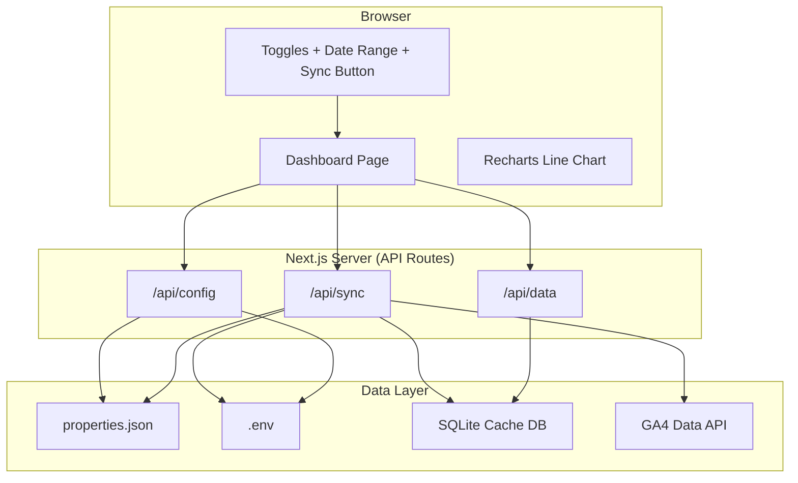

# Design Document: GA Multi-Property Dashboard

## Overview

The GA Multi-Property Dashboard is a Next.js web application that aggregates daily session data from multiple Google Analytics 4 (GA4) properties and visualizes them as colored lines on a single chart. The app reads property definitions from a `properties.json` config file, authenticates via a Google service account, caches fetched data in SQLite, and provides on-demand sync triggered by the user.

The design prioritizes:
- **Early UX validation** via a prototype/mock mode that renders the full UI with hardcoded data
- **Minimal API usage** through SQLite caching and incremental date-gap fetching
- **Graceful degradation** so partial API failures never crash the dashboard
- **Simple deployment** to local dev, Vercel, or any VPS

### Key Design Decisions

| Decision | Choice | Rationale |
|---|---|---|
| Framework | Next.js (App Router) | SSR/API routes in one project; deploys to Vercel trivially |
| Charting | Recharts | React-native, composable, good legend/toggle support |
| Database | SQLite via `better-sqlite3` | Zero-config local DB; single file; fast reads |
| Auth | Google service account + `google-auth-library` | No interactive OAuth; works in CI/server contexts |
| GA4 API client | `@google-analytics/data` | Official Node.js client for GA4 Data API |
| Config | `properties.json` + `.env` | Simple file-based config; env vars for secrets |
| Sync model | On-demand only (button click) | User controls API spend; no background polling |

## Architecture



### Request Flow

1. **Page load**: Client calls `GET /api/config` → reads `properties.json`, returns property list + mock mode flag
2. **Chart render**: Client calls `GET /api/data?range=30` → queries SQLite, returns `{ propertyId, date, sessions }[]`
3. **Sync**: Client calls `POST /api/sync` with `{ dateRange }` → server re-reads config, computes missing dates per property, fetches from GA4 API, upserts into SQLite, returns summary
4. **Mock mode**: If `MOCK_MODE=true` or `properties.json` missing, `/api/config` returns mock properties and `/api/data` returns generated mock data. Sync button is hidden.

## Components and Interfaces

### API Routes

#### `GET /api/config`
Returns the current property configuration and app mode.

```typescript
// Response
interface ConfigResponse {
  mode: "live" | "mock";
  properties: PropertyConfig[];
  errors: string[];  // validation warnings for skipped entries
}

interface PropertyConfig {
  propertyId: string;
  displayName: string;
}
```

#### `GET /api/data?range=30&properties=id1,id2`
Returns cached session data for the requested date range and properties.

```typescript
// Response
interface DataResponse {
  data: SessionRecord[];
  lastSyncTimestamps: Record<string, string | null>; // propertyId → ISO timestamp
}

interface SessionRecord {
  propertyId: string;
  date: string;       // YYYY-MM-DD
  sessionCount: number;
}
```

#### `POST /api/sync`
Triggers on-demand data fetch from GA4 API.

```typescript
// Request
interface SyncRequest {
  dateRange: number; // days: 30, 60, 90, 180, 365
}

// Response
interface SyncResponse {
  results: SyncPropertyResult[];
}

interface SyncPropertyResult {
  propertyId: string;
  displayName: string;
  status: "success" | "error";
  recordsFetched: number;
  error?: string;
}
```

### Client Components

#### `DashboardPage` (main page component)
- Fetches config on mount
- Renders mock or live mode based on config response
- Manages state: selected date range, toggle states, sync status, chart data

#### `LineChartPanel`
- Receives `SessionRecord[]` and `PropertyConfig[]`
- Renders a Recharts `<LineChart>` with one `<Line>` per visible property
- Handles missing dates by filling with zero
- Recalculates Y-axis domain when toggles change

#### `PropertyToggles`
- Renders one toggle per property with display name label
- Emits visibility changes to parent
- Shows warning badge on properties that failed sync

#### `DateRangeSelector`
- Dropdown with options: 30, 60, 90, 180, 365 days
- Emits selected range to parent

#### `SyncButton`
- Shows "Populate Data" when no cached data exists, "Get New Data" otherwise
- Disabled + spinner while sync is in progress
- Triggers `POST /api/sync`

#### `ErrorBanner`
- Displays config errors, auth errors, or network errors
- Shows setup guide when no properties are loaded

### Server Modules

#### `lib/config.ts`
- `loadProperties()`: Reads and validates `properties.json`
- Returns `{ properties, errors }` where errors list skipped entries
- Returns mock properties when in mock mode

#### `lib/db.ts`
- `initDb()`: Creates SQLite table if not exists
- `getSessionData(propertyIds, startDate, endDate)`: Query cached data
- `upsertSessionData(records)`: Insert or update session records
- `getMissingDates(propertyId, startDate, endDate)`: Returns dates not yet cached
- `getLastSyncTimestamp(propertyId)`: Returns last sync time
- `hasAnyData()`: Returns boolean for sync button label logic

#### `lib/ga4.ts`
- `createGa4Client()`: Authenticates using service account credentials from env vars
- `fetchSessionData(client, propertyId, startDate, endDate)`: Calls GA4 Data API for sessions by date
- Handles retries (3 attempts, exponential backoff) internally

#### `lib/mock.ts`
- `generateMockData(properties, days)`: Produces realistic-looking session data with daily variance
- Used by `/api/data` in mock mode

## Data Models

### SQLite Schema

```sql
CREATE TABLE IF NOT EXISTS sessions (
  property_id TEXT NOT NULL,
  date TEXT NOT NULL,          -- YYYY-MM-DD
  session_count INTEGER NOT NULL DEFAULT 0,
  synced_at TEXT NOT NULL,     -- ISO 8601 timestamp
  PRIMARY KEY (property_id, date)
);

CREATE INDEX IF NOT EXISTS idx_sessions_property_date
  ON sessions (property_id, date);
```

The `PRIMARY KEY (property_id, date)` enforces the unique constraint from Requirement 4.4. Upserts use `INSERT ... ON CONFLICT (property_id, date) DO UPDATE SET session_count = excluded.session_count, synced_at = excluded.synced_at`.

### `properties.json` Schema

```json
[
  {
    "propertyId": "531170948",
    "displayName": "My Blog"
  },
  {
    "propertyId": "412938571",
    "displayName": "Portfolio Site"
  }
]
```

Validation rules:
- Must be a valid JSON array
- Each entry must have `propertyId` (string) and `displayName` (string)
- Entries missing either field are skipped with a logged warning

### Environment Variables (`.env`)

```
GOOGLE_APPLICATION_CREDENTIALS=./service-account-key.json
# OR inline credentials:
# GOOGLE_SERVICE_ACCOUNT_EMAIL=...
# GOOGLE_PRIVATE_KEY=...
MOCK_MODE=false
```


## Correctness Properties

*A property is a characteristic or behavior that should hold true across all valid executions of a system — essentially, a formal statement about what the system should do. Properties serve as the bridge between human-readable specifications and machine-verifiable correctness guarantees.*

### Property 1: Config parsing preserves valid entries

*For any* JSON array of property objects where each object may or may not have `propertyId` and `displayName` fields, `loadProperties()` SHALL return exactly the entries that have both fields present, in order, and report warnings for skipped entries.

**Validates: Requirements 1.1, 1.2, 1.4**

### Property 2: Invalid config produces descriptive error

*For any* string that is not valid JSON (or is valid JSON but not an array), `loadProperties()` SHALL return an error result containing a descriptive message about the configuration problem.

**Validates: Requirements 1.3**

### Property 3: Missing date computation is the set difference

*For any* date range `[startDate, endDate]` and any set of dates already cached for a property, `getMissingDates(propertyId, startDate, endDate)` SHALL return exactly the dates in the range that are not in the cached set.

**Validates: Requirements 3.3, 5.5**

### Property 4: Session data insert round-trip

*For any* set of valid session records `(propertyId, date, sessionCount)`, inserting them via `upsertSessionData()` and then querying via `getSessionData()` for the same property IDs and date range SHALL return records with matching property IDs, dates, and session counts.

**Validates: Requirements 4.2**

### Property 5: Upsert overwrites with latest value

*For any* `(propertyId, date)` pair and two different session counts, upserting the first count then upserting the second count SHALL result in `getSessionData()` returning only one record for that pair with the second (latest) session count.

**Validates: Requirements 4.4, 4.5**

### Property 6: Chart data produces one series per property with distinct colors

*For any* non-empty set of `PropertyConfig` entries, the chart data transformation SHALL produce exactly one data series per property, and no two series SHALL share the same color.

**Validates: Requirements 6.1**

### Property 7: Date gap filling produces zero for missing dates

*For any* date range and any session dataset that has gaps (dates with no records for a property), the gap-fill transformation SHALL produce a complete series where every date in the range has a value, with zero for dates that had no data.

**Validates: Requirements 6.5**

### Property 8: Y-axis domain matches visible data

*For any* session dataset and any subset of properties marked as visible, the computed Y-axis maximum SHALL equal the maximum session count among the visible properties' data (or a sensible default when no data is visible).

**Validates: Requirements 7.4**

### Property 9: Mock data generator produces correct structure

*For any* property count ≥ 1 and day count ≥ 1, `generateMockData(properties, days)` SHALL return exactly `propertyCount × dayCount` records, with each property having exactly `dayCount` consecutive daily entries and all session counts being non-negative integers.

**Validates: Requirements 11.1**

### Property 10: Config-driven data filtering

*For any* set of cached session records spanning N properties and any config listing a subset of M properties (M ≤ N), querying data filtered by the current config SHALL return records only for the M configured properties, excluding all others.

**Validates: Requirements 12.3, 12.4**

## Error Handling

### Error Categories and Responses

| Error | Detection | User-Facing Response | Recovery |
|---|---|---|---|
| `properties.json` missing | `fs.readFile` throws ENOENT | Activate mock mode (Req 11.4) | User creates config file |
| `properties.json` invalid JSON | `JSON.parse` throws | Error banner with parse error details | User fixes JSON syntax |
| Entry missing fields | Validation in `loadProperties()` | Warning logged; entry skipped | User fixes entry |
| Service account credentials missing | Env var check on startup | Error banner with setup instructions | User configures `.env` |
| Service account auth failure | `google-auth-library` throws | Error banner describing auth issue (Req 9.5) | User checks credentials |
| GA4 API 403 for a property | API response status | Warning badge on property toggle (Req 9.4); log warning | User grants access |
| GA4 API network error | Fetch timeout/rejection | Retry 3× with exponential backoff (Req 5.8); then warning badge | Auto-retry; user retries manually |
| GA4 API unreachable (all properties) | All fetches fail | Show cached data + connectivity error banner (Req 9.6) | User checks network |
| SQLite write failure | `better-sqlite3` throws | Error banner; sync marked as failed | User checks disk space/permissions |

### Retry Strategy

```
Attempt 1: immediate
Attempt 2: wait 1s
Attempt 3: wait 4s
After 3 failures: log error, mark property as failed, continue with next property
```

### Partial Failure Handling

The sync process iterates over properties independently. A failure for one property does not abort the sync for others. The response includes per-property status so the UI can show:
- Success: data refreshed, no badge
- Failure: warning badge on toggle with tooltip showing the error reason (Req 9.8)

## Testing Strategy

### Unit Tests

Unit tests cover specific examples, edge cases, and integration points:

- **Config loading**: Valid config, empty array, missing file, invalid JSON, entries with missing fields
- **Mock mode detection**: All 4 combinations of config presence × `MOCK_MODE` env var
- **Sync button label**: "Populate Data" vs "Get New Data" based on `hasAnyData()`
- **Date range selector**: Default value, all options present
- **Toggle behavior**: Initial state (all on), toggle off removes line, toggle on restores line
- **Retry logic**: 1 failure + success, 3 failures + give up, exponential backoff timing
- **Error display**: Auth errors, network errors, partial failures, setup guide
- **Chart rendering**: Legend presence, axis labels, line count matches property count

### Property-Based Tests

Property-based tests use [fast-check](https://github.com/dubzzz/fast-check) (the standard PBT library for TypeScript/JavaScript). Each test runs a minimum of 100 iterations.

| Property | Test Target | Generator Strategy |
|---|---|---|
| P1: Config parsing | `loadProperties()` | Random arrays of objects with optional `propertyId`/`displayName` fields |
| P2: Invalid config error | `loadProperties()` | Random non-JSON strings and non-array JSON values |
| P3: Missing dates | `getMissingDates()` | Random date ranges + random subsets of dates within range |
| P4: Session round-trip | `upsertSessionData()` + `getSessionData()` | Random `(propertyId, date, count)` tuples |
| P5: Upsert overwrites | `upsertSessionData()` × 2 + `getSessionData()` | Random `(propertyId, date)` + two random counts |
| P6: Chart series | Chart data transformer | Random `PropertyConfig[]` arrays |
| P7: Gap filling | Gap-fill function | Random date ranges + sparse session data |
| P8: Y-axis domain | Y-axis calculator | Random session data + random visibility booleans |
| P9: Mock data | `generateMockData()` | Random property counts (1–10) and day counts (1–365) |
| P10: Config filtering | Data filter function | Random cached data for N properties + random config subset |

Each property test is tagged with a comment:
```
// Feature: ga-multi-property-dashboard, Property 1: Config parsing preserves valid entries
```

### Integration Tests

- **GA4 API fetch**: Mock `@google-analytics/data` client, verify request format and response parsing
- **Full sync cycle**: Mock API → upsert → query → verify chart data pipeline
- **Vercel deployment**: Verify env var reading in production mode

### End-to-End Tests (Manual)

- Start app in mock mode, verify all UI elements render
- Start app with real `properties.json`, trigger sync, verify chart updates
- Remove a property from config, trigger sync, verify it disappears from chart
